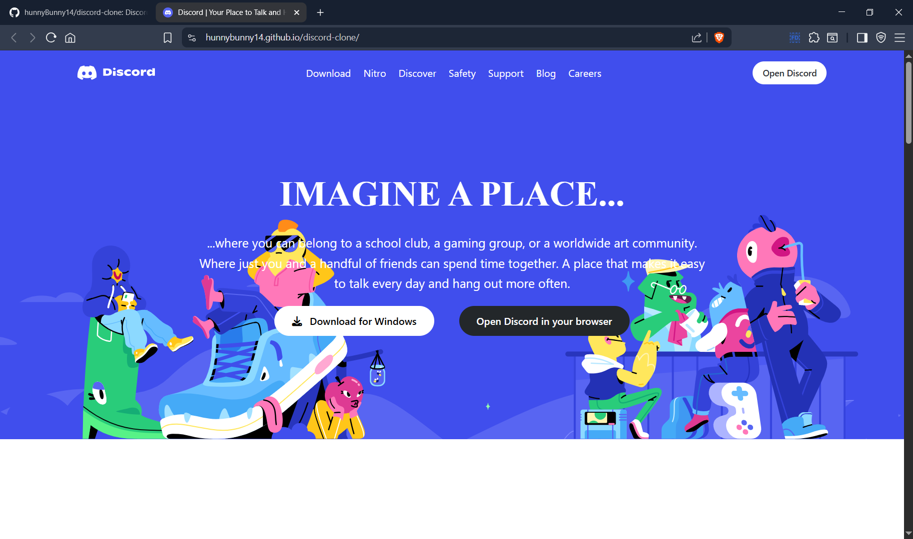

# 🎨 Discord Clone Landing Page  

A **modern, fully responsive landing page** inspired by [Discord](https://discord.com), built with **HTML5 + Tailwind CSS**.  
This project is part of my web development journey and showcases **clean UI design, responsive layouts, and attention to detail**.  

---

## 🌟 Demo  

🔗 [Live Preview (GitHub Pages)](https://hunnyBunny14.github.io/discord-clone)  

---

## 📸 Screenshots  

### 🖥️ Desktop View  
  

### 📱 Mobile View  
  

---

## ⚡ Features  

- 🎯 **Pixel-perfect clone** of Discord’s landing page  
- 📱 **Fully Responsive** (works on mobile, tablet & desktop)  
- 🎨 Built with **Tailwind CSS** for rapid styling  
- 🌐 Optimized with **Google Fonts & FontAwesome Icons**  
- ⚡ **Fast & Lightweight** – no frameworks, pure HTML + Tailwind  
- 🛠️ Clean code structure for scalability  

---

## 🛠️ Tech Stack  

- **HTML5** – Semantic & structured markup  
- **Tailwind CSS** – Utility-first CSS framework  
- **FontAwesome** – Icons  
- **Google Fonts** – Custom typography  

---

## 🚀 Getting Started  

Clone the repository and open in your browser:  

```bash
# Clone the repo
git clone https://github.com/hunnyBunny14/discord-clone.git

# Navigate to folder
cd discord-clone

# Open in browser
open index.html   # (or just double click index.html)
discord-clone/
│── images/             # All assets (logos, svgs, illustrations)
│── src/
│   └── App.css         # Tailwind CSS & custom styles
│── index.html          # Main entry file
│── README.md           # Project documentation
🔥 Future Enhancements

✅ Add hamburger menu functionality for mobile

✅ Optimize images to .webp for faster loading

✅ Deploy on Netlify/Vercel for live hosting

✅ Add dark/light theme toggle

🤝 Contributing

Contributions are welcome! Feel free to:

🐛 Report bugs

💡 Suggest new features

🔥 Open pull requests

📬 Contact

👤 Hunny Dhingia

📧 Email

🌐 Portfolio (coming soon)

💼 LinkedIn

🐙 GitHub

📜 License

This project is licensed under the MIT License – feel free to use and modify it!
